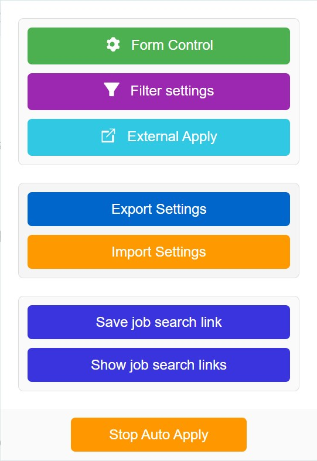
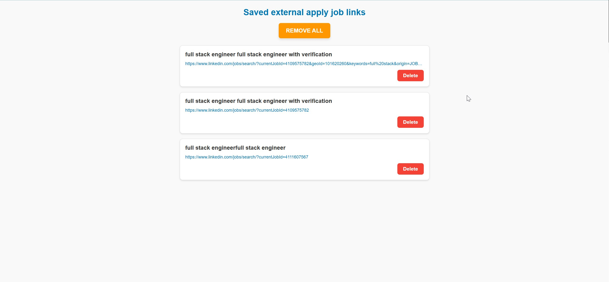
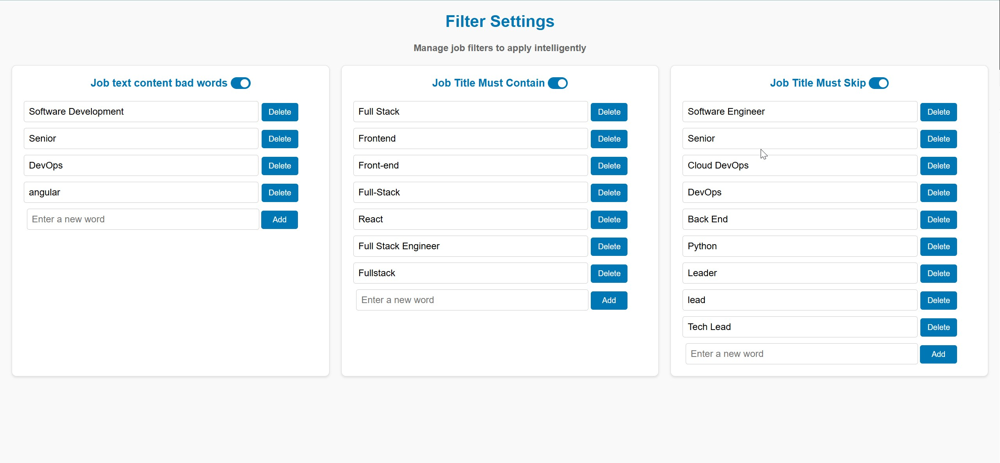
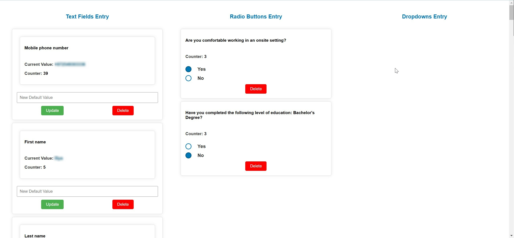
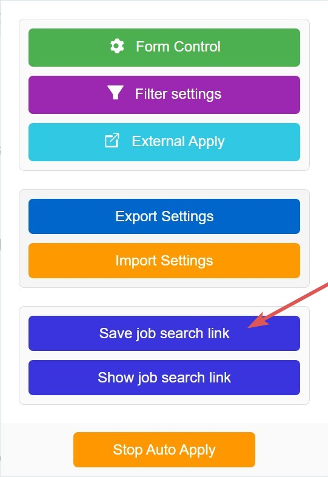
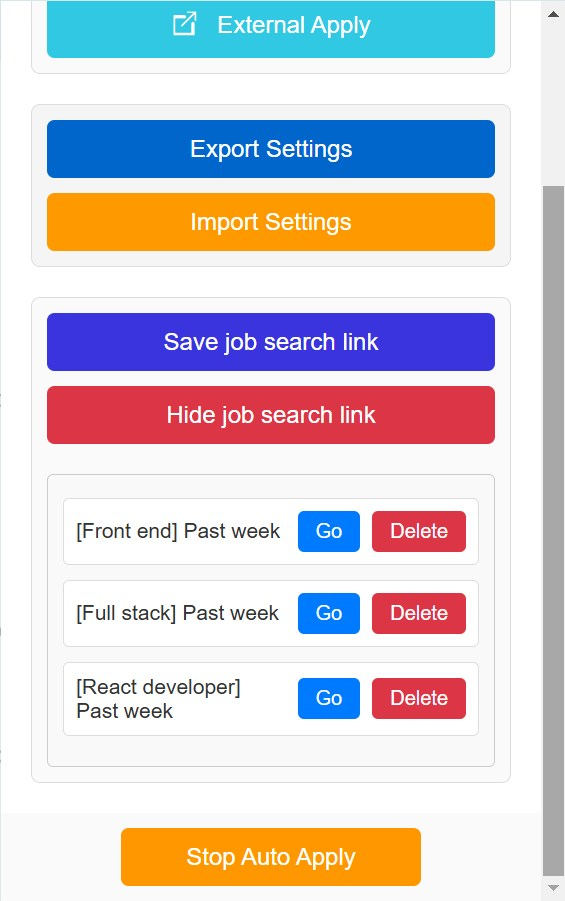
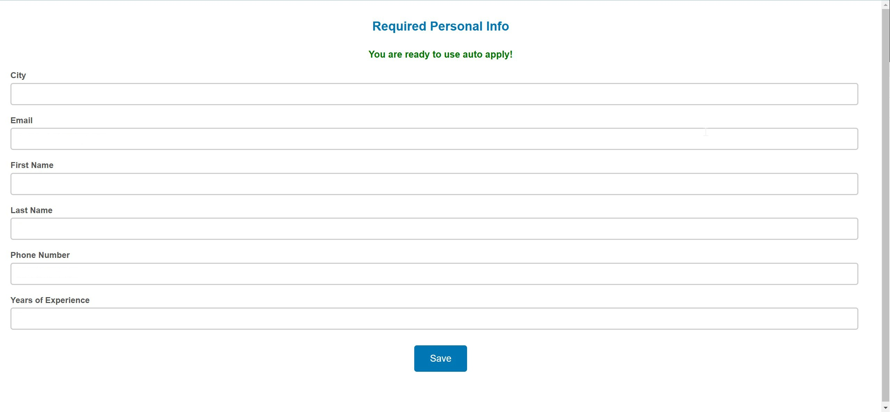

# Easy Apply LinkedIn Chrome Extension

## Overview

**Easy Apply LinkedIn** is a Chrome extension designed to streamline the process of applying for jobs on LinkedIn. By automating the application process for Easy Apply jobs and organizing other applications, this tool saves time and enhances productivity for job seekers.

## What's new in 1.1
We improved the “External Apply” feature to store only unique job postings. Duplicates are now automatically removed based on the link and the combination of title + company name. This way, you’ll always see the latest and unique listings.

## Features

### 1. Popup Menu
- The main interface of the extension, accessible via the Chrome toolbar.
- Allows quick navigation to various pages and settings.



### 2. External Apply Links
- Saves links to job applications that are not Easy Apply for manual submission later.
- Ensures no job opportunities are missed.



### 3. Filter Settings
- **Job Title Must Contain**: Filters jobs whose titles include specified keywords.

- **Job Title Must Skip**: Excludes jobs whose titles include specified keywords (takes priority over "Must Contain").

- **About the job bad words**: Filters out jobs with unwanted keywords in the job description.

- Users can customize these filters for a more tailored job search.



### 4. Form Control
- Displays all the questions encountered by the bot during job applications.

- Users can fill in these questions to improve application accuracy.



### 5. Personal Information
- Stores user details such as name, email, phone number, and location.

- Required for submitting applications.

### **New Feature** ###
#### Job Search Links Feature

You can now easily save your preferred LinkedIn job search links with your custom filters and use them even when you're not on LinkedIn. Here’s how it works:

1. **Perform Your Job Search**  
   Go to [LinkedIn > Jobs](https://www.linkedin.com/jobs) and perform a job search using the filters you use most frequently.

2. **Save the Job Search Link**  
   In the extension popup, click on **Save job search link**. Enter a name for your search link. This saves the current URL along with your selected filters.
   
3. **Launch the Bot Anywhere**  
   Even if you are not currently on the LinkedIn platform, simply open the popup and click on **Show job search links**.
   
   - An accordion will display all your saved job search links.
   - Select the desired link and click **Go**.
   
   The extension will automatically navigate to the specified LinkedIn job search page and start working with your saved filters – no additional input is required.

This new feature streamlines the process, allowing you to quickly resume your job search with your preferred settings, regardless of which website you are currently browsing.



## How to Install

1. Clone the repository from GitHub:

    ```bash
    git clone https://github.com/IliyaBrook/EasyApplyLinkedIn.git
    ```
2. Open Chrome and navigate to `chrome://extensions`.
3. Enable **Developer Mode** in the top-right corner.
4. Click **Load unpacked** and select the extension folder.
5. The extension will now appear in your Chrome toolbar.

### The extension available for now at Official [*Chrome Web Store*](https://chromewebstore.google.com/detail/easyapplylinkedin/gncaadiobcdbnfnapjcjnpnibkgebfnk?hl=en-US&utm_source=ext_sidebar)

#### Please note that the extension will soon be available in the Chrome Web Store for easier installation. Stay tuned!

## Usage

1. Open the extension popup via the Chrome toolbar.
2. Set up personal information and filters to match your preferences.
3. Start the auto-apply process by clicking **Start Auto Apply** in the popup menu.
4. Monitor and manage external apply links for manual applications.
5. Regularly check the **Form Control** page to ensure all questions are accurately filled.

## Feedback and Support

If you encounter any bugs or have suggestions for improvements, feel free to open an issue on GitHub:

[GitHub Issues](https://github.com/IliyaBrook/EasyApplyLinkedIn/issues)

## Happy Coding!
